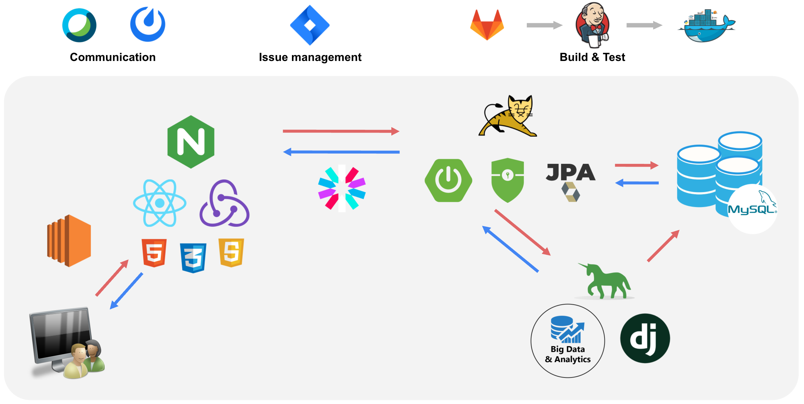
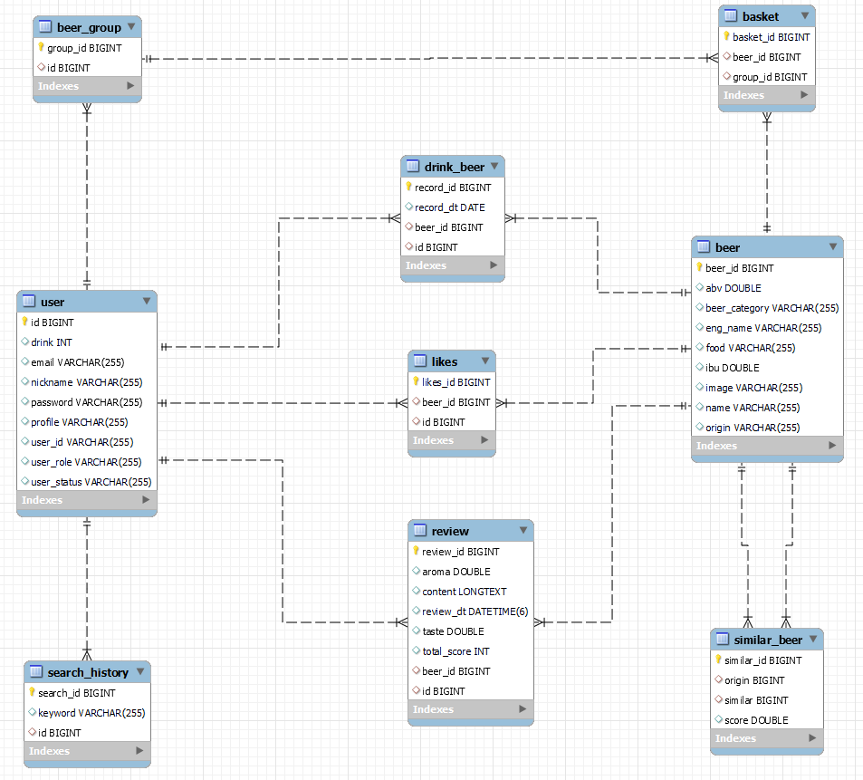

    

            </img>   </img>  </img> </img>                

  

</img>

# 🍻 BUUR - 편의점 맥주 추천 서비스

## 📜 서비스 소개

---

사용자의 취향을 분석해 4캔 맥주를 쉽게 고를 수 있도록 추천하는 서비스입니다.

다양한 맥주들을 음미하며 자신만의 맥주 스타일을 찾아가는 재미를 느껴보세요

여러분이 마신 맥주를 냉장고, macBTI 기능을 통해 한 눈에 볼 수 있어요!

## 📝 기획 의도

---

편의점에서 4가지에 만원인 세계 맥주를 고를 때 고민을 덜어주기 위하여 기획하였습니다.

## 🎯 타겟

---

- 새로운 맥주에 도전해보고 싶은 사람들
- 편의점 4캔 맥주 선택에 어려움을 겪는 사람들

## 📅 개발 기간

---

**22.02.28 ~ 22.04.08 (6주)**

## 🔍 주요 기능

---

### 메인 페이지

- 전체 상품 보기
- 맥주 분류 별 보기

### 🌟추천 기능

- 즐겨 찾는 맥주
- 맥주 추천
- 맥주 상세 페이지의 비슷한 맥주 추천

### 장바구니

- 맥주 장바구니 담기

### 검색 기능

- 찾고 싶은 맥주를 검색

### 마이페이지

- 내 정보 수정
- 프로필 사진 설정
- 냉장고 둘러보기
- MacBTI

## 📊 Gantt Chart

---

## 📌 개발 약속

---

- Git
    - Commit : feat, fix, docs, test
    - Git Flow : master, hotfix, develop, feature
- React : [Airbnb 네이밍 가이드](https://github.com/apple77y/javascript/tree/master/react#%EB%AA%85%EB%AA%85%EA%B7%9C%EC%B9%99)
- Java : [네이버 Java 컨벤션](https://naver.github.io/hackday-conventions-java/)
    - Spring : [spring 네이밍 컨벤션](https://cocobi.tistory.com/27)
- Rest API
    - URL : 소문자, dash(-) 사용, 행위 X

## 🛠️ 프로젝트 구조

---

## 🌐 ERD

---

## 👨‍👨‍👧‍👦 팀원 소개

---

| Name | Role | Position | Git |
| --- | --- | --- | --- |
| 장성태 | 팀장 / 발표 | Frontend |  |
| 김유정 | React 노력왕 / Model / 추천 | Frontend Django |  |
| 오수경 | Director / Front 고수 | Frontend | @Oh-Su |
| 오은진 | DB Robort / Back 고수 | Backend | @Oh-EinJin |
| 이주형 | 추천/ Back 왕고수 (PM) | Backend Django | @leeejuhyeong |
| 조용구 | Full Stack 고수 | Frontend Backend | @younygo1004 |

## 👨‍👨‍👧‍👦 역할 분담

---

| Name | Position | Role |
| --- | --- | --- |
| 장성태 | Frontend | 로그인 회원가입 설문 UCC 촬영  발표 |
| 김유정 | Frontend Django | 맥주 냉장고 맥주 추천 UCC 촬영 |
| 오수경 | Frontend | 맥주 리스트 장바구니 리뷰 UCC 감독 |
| 오은진 | Backend | 냉장고 장바구니 Macbti 검색|
| 이주형 | Backend Django | 맥주 검색 맥주 추천 |
| 조용구 | Backend Frontend | 유저 리뷰 로그인 회원가입 설문 |
